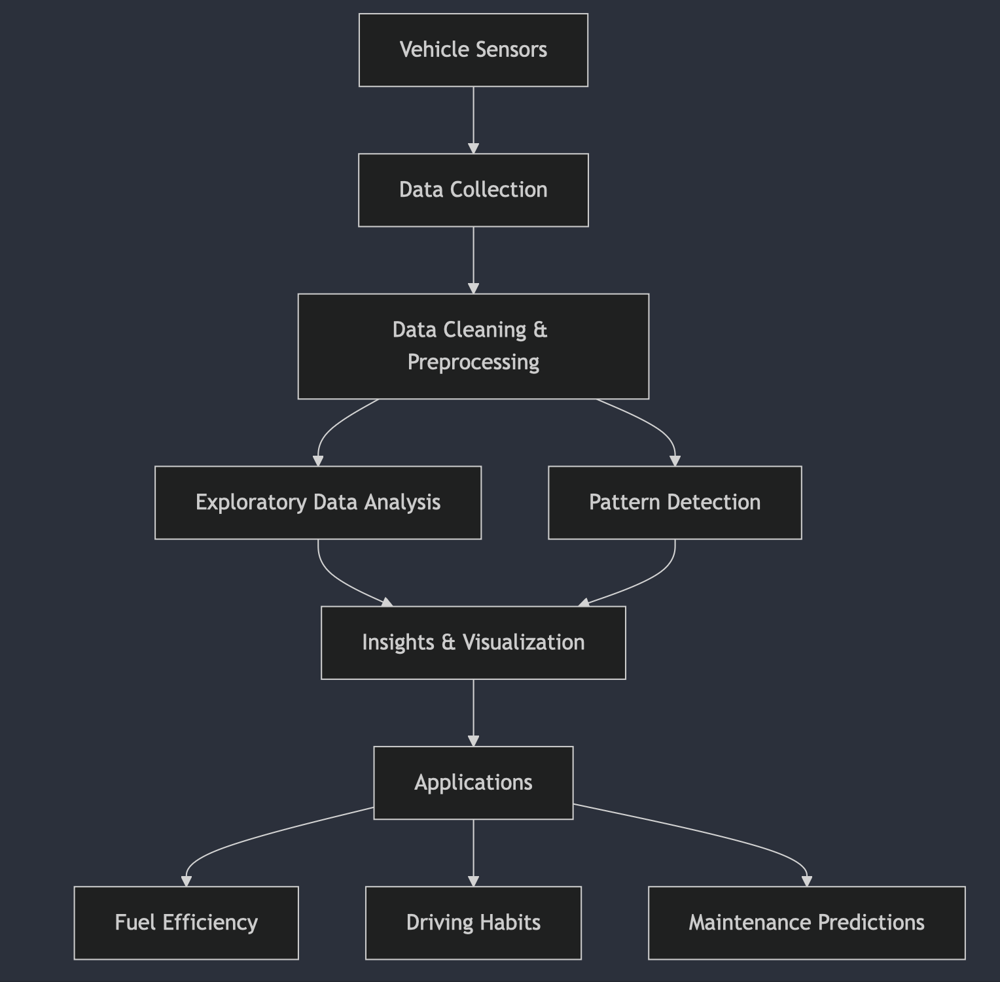
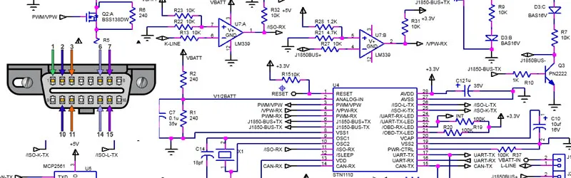

**# DSA210_Yagiz - Vehicle Sensor Data Analysis**
---

### **Exploring Data, Driving Insights**

---

### **Author**:  
A Project on Vehicle Dynamics and Patterns by [Kadir Yağız Ebil](https://github.com/YagizEbil) 

### **Table of Contents**

1. [Introduction](#introduction)  
2. [Dataset Overview](#description-of-dataset)  
3. [Sensors and Data Fields](#sensor-details)  
4. [Project Goals](#project-motivationidea)  
5. [Results for Analysis](#results-for-analysis)
6. [Results for Predictive Model](#results-for-predictive-model)
7. [Challenges and Future Directions](#possible-limitations-and-future-plans)  

---

### **Introduction**  
Welcome to the comprehensive study of vehicle sensor data! This project leverages insights from over 51 diverse sensors to analyze driving behavior, vehicle performance, and environmental interactions. With applications ranging from fuel efficiency analysis to understanding driving habits.



---

#### *Embark on the journey to decode your drive!*
## Description of Dataset

This project involves a dataset containing sensor data from a vehicle, collected via an [OBD module](#obd-module-description). The dataset captures various vehicle parameters and environmental conditions, structured as follows:

### Sample Data (CSV Format)
```csv
"SECONDS";"PID";"VALUE";"UNITS";"LATITUDE";"LONGITUDE";
"30189.243321";"Altitude (GPS)";"185.400009155273";"m";"40.9135431";"29.2909024";
"30189.243321";"Average speed (GPS)";"0";"km/h";"40.9135431";"29.2909024";
"30189.243321";"Speed (GPS)";"0";"km/h";"40.9135431";"29.2909024";
"30189.264321";"Altitude (GPS)";"185.400009155273";"m";"40.9135431";"29.2909024";
"30189.264321";"Average speed (GPS)";"0";"km/h";"40.9135431";"29.2909024";
"30189.264321";"Speed (GPS)";"0";"km/h";"40.9135431";"29.2909024";
"30189.472321";"Altitude (GPS)";"226.446453780756";"m";"40.9135431";"29.2909024";
```

### Columns in the Dataset:
- **SECONDS**: Time of the day in seconds.
- **PID**: Identifier for the specific sensor.
- **VALUE**: Measurement from the sensor during the time frame.
- **UNITS**: Units of the recorded value.
- **LATITUDE**: Geographical latitude of the vehicle.
- **LONGITUDE**: Geographical longitude of the vehicle.

### Sensors Included in the Dataset:
A total of 51 sensors capture diverse metrics, ranging from GPS-based speed and altitude to engine parameters. These sensors include:

1. **Altitude (GPS)**: Vehicle’s elevation above sea level.
2. **Average Speed (GPS)**: Mean speed over a trip or specific period.
3. **Speed (GPS)**: Real-time speed derived from GPS signals.
4. **Engine Coolant Temperature**: Monitors coolant temperature to prevent overheating.
5. **Fuel Consumption**: Tracks instantaneous and cumulative fuel usage.
6. **Engine RPM**: Rotational speed of the engine, measured in revolutions per minute.
7. **Throttle Position**: Reflects the position of the throttle, influencing air intake and engine power.
8. **Oxygen Sensors**: Provide data on air-fuel mix and emissions control.
9. **Catalyst Temperature**: Monitors the catalytic converter’s efficiency.
10. **Ambient Air Temperature**: External air temperature affecting engine efficiency.

For the full list of sensors and their descriptions, see the **[Sensor Details](#sensor-details)** section.

---

## Project Motivation/Idea

The primary goal of this project is to explore the relationship between vehicle sensor data and external events or patterns, such as:

- **Daily Driving Habits**: Analyzing correlations between driving behaviors, fuel efficiency, and time of day.
- **Personality Insights**: Assessing how vehicle handling and sensor metrics reflect driving styles or preferences.
- **Fuel Provider Comparisons**: Evaluating how different fuel types/providers affect engine performance and fuel economy.

This analysis aims to uncover patterns that can improve driving efficiency, vehicle maintenance, and overall understanding of driving behaviors.

---

## Results for Analysis

### Data Cleaning and Preprocessing
	•	Successfully loaded all CSV files in the data folder into a Python dictionary.
	•	Removed unnamed columns and ensured a clean, structured format for analysis.
	•	Sorted the dataset chronologically for accurate analysis and visualization.

### Comparison of Driving Styles: Father vs. Me
	1.	Speed Analysis:
	•	Differences in driving habits highlighted smoother speed variations for “Father” and more aggressive changes for “Me”.
	•	Data saved to data/father_speed.txt and data/me_speed.txt.
	2.	Throttle Position Analysis:
	•	“Father” exhibited consistent throttle control, while “Me” had wider variations, indicating aggressive acceleration.
	•	Data saved to data/father_throttle.txt and data/me_throttle.txt.
	3.	Statistical Findings:
	•	Average, maximum, and standard deviations calculated for key metrics.
	•	Statistical summary saved in driving_behavior_comparison.csv.
	4.	Hypothesis Testing:
	•	T-tests showed significant differences in driving styles for specific metrics such as throttle position and acceleration.

### Fuel Provider Comparison
	1.	Radar Chart Metrics:
	•	Normalized values for key metrics (e.g., Engine Load, Fuel Efficiency).
	•	Derived metrics such as “Aggressiveness”, “Efficiency”, and “Load to RPM Ratio”.
	•	Data saved in data/fuel_provider_comparison.txt.
	2.	Provider Insights:
	•	Radar charts revealed significant differences between fuel providers.
	•	“Provider C” demonstrated the highest efficiency, while “Provider A” had higher aggressiveness metrics.

### Visual Highlights
	•	Comparative line plots for driving metrics saved in the images folder.
	•	Radar chart visualizing fuel provider performance displayed key distinctions.

---

## Results for Predictive Model
### Model Development for Predicting Instant Fuel Rate
#### 1. Data Loading and Preprocessing
##### Files Loaded
- All CSV files in the data folder were successfully loaded and combined into a single DataFrame.
##### Data Cleaning
- Dropped irrelevant columns (LATITUDE, LONGITUDE, etc.).
- Filtered data to retain only relevant PIDs for analysis, including Vehicle speed, Engine RPM, and Throttle position.
##### Data Transformation
- Pivoted the data to create a wide format, where each PID became a feature.
- Engineered new features like Engine RPM x1000 and Instant engine power for better predictive capabilities.
##### Feature Scaling
- Applied StandardScaler to normalize feature values for improved model performance.
#### 2. Model Training
##### Split Data
- Data split into training (80%) and testing (20%) sets.
##### Model Used
- Random Forest Regressor, initialized with default parameters.
###### Initial Results
- Mean Absolute Error (MAE): 0.281700095467111
- Root Mean Squared Error (RMSE): 0.40095810517024466
- R-squared (R2): 0.7099489148184635

#### 3. Hyperparameter Tuning

##### Grid Search
- Performed a grid search over parameters like `n_estimators`, `max_depth`, and `min_samples_split`.

##### Best Model
- Achieved improved R2 score: Best R2

##### Hyperparameter Combination
- Example: `n_estimators = 200`, `max_depth = 30`, `min_samples_split = 2`, `min_samples_leaf = 1`.

#### 4. Feature Importance

##### Top Features
- Engine RPM
- Calculated engine load value
- Throttle position

##### Insights
- Features related to engine dynamics and vehicle load had the highest predictive impact.

#### 5. Model Deployment

##### Saved Artifacts
- Model saved as `random_forest_model.pkl`.
- Scaler saved as `scaler.pkl`.

##### Prediction Function
- Created a reusable function to predict the instant fuel rate for new data inputs.

#### 6. Example Prediction

##### Input
- [60 km/h, 2500 RPM, 90°C coolant, 50% throttle, 100 kPa intake pressure, etc.]

##### Predicted Instant Fuel Rate
- 3.7529546851857742

#### Key Findings

##### Driving Dynamics
- High throttle usage and engine load directly increased the predicted fuel rate.
- Steady driving with lower acceleration resulted in more efficient fuel usage.

##### Feature Contribution
- Engine RPM and load-to-power ratio emerged as critical factors for predicting fuel rates.

## Sensor Details

Below is a detailed description of all sensors in the dataset, including their purpose and significance:

| Sensor (PID) | Description |
|--------------|-------------|
| Altitude (GPS) | Elevation above sea level. |
| Speed (GPS) | Real-time speed measured via GPS. |
| Engine Coolant Temperature | Prevents overheating by monitoring coolant temperature. |
| Throttle Position | Tracks throttle valve position, crucial for engine performance. |
| Oxygen Sensors | Measure oxygen levels for combustion optimization. |
| Catalyst Temperature | Essential for emission control. |
| Fuel Consumption | Tracks both instantaneous and total fuel usage. |
| Engine RPM | Monitors engine rotational speed. |

For a complete list of all 51 sensors, refer to the **[Full Sensor Descriptions](#full-sensor-descriptions)** section.


## Pure Technical Data
### OBD Module Description

The dataset relies on data collected from an On-Board Diagnostics (OBD) module. OBD is a standardized system in vehicles that monitors and reports on various engine and vehicle parameters. Key features of the OBD system:



- Real-Time Data Collection: Captures data such as speed, RPM, throttle position, and more.
- Fault Code Detection: Identifies engine or system malfunctions through diagnostic trouble codes (DTCs).
- Connectivity: Compatible with most modern vehicles, allowing for consistent data extraction.
### Full Sensor Descriptions

Below is the comprehensive list of all 51 sensors included in the dataset, along with their detailed descriptions:

1. **Altitude (GPS)**: Measures the vehicle’s elevation above sea level using GPS data. Useful for assessing how terrain affects vehicle performance.
2. **Average Speed (GPS)**: Calculates the mean speed of the vehicle over a trip or specific period using GPS data.
3. **Speed (GPS)**: Real-time vehicle speed derived from GPS signals, used to cross-check or complement speed data from wheel or transmission sensors.
4. **Absolute Throttle Position B**: Represents the throttle valve’s position, critical for engine power output and fuel management.
5. **Absolute Pedal Position D**: Tracks the position of the accelerator pedal. Useful for understanding driver intent and controlling throttle.
6. **OBD Module Voltage**: Voltage supplied to the OBD module, indicating battery health or charging system performance.
7. **Calculated Engine Load Value**: Shows how much of the engine’s capacity is currently being used, which helps assess engine strain and fuel efficiency.
8. **Engine Coolant Temperature**: Measures the engine’s coolant temperature to prevent overheating, essential for engine health and efficiency.
9. **Short Term Fuel % Trim - Bank 1**: Immediate adjustments to the air-fuel ratio, ensuring optimal combustion efficiency in Bank 1 (one side of the engine).
10. **Long Term Fuel % Trim - Bank 1**: Long-term adjustments in fuel-air mix, indicating trends in engine performance over time.
11. **Calculated Boost**: Represents the extra pressure in the intake manifold, typically from a turbocharger, enhancing engine performance.
12. **Intake Manifold Absolute Pressure**: Measures the air pressure within the intake manifold, affecting fuel delivery for optimal combustion.
13. **Calculated Instant Fuel Rate**: Determines the fuel consumption rate at any instant, useful for real-time fuel efficiency monitoring.
14. **Engine RPM**: Measures the rotational speed of the engine, indicating performance and load on the engine.
15. **Engine RPM x1000**: Engine speed in thousands of revolutions per minute, providing a clearer metric for high-performance engines.
16. **Instant Engine Power (based on fuel consumption)**: Estimates engine power output using fuel consumption rates, useful for real-time performance monitoring.
17. **Vehicle Acceleration**: Measures the rate of change in vehicle speed, used for evaluating driving habits and vehicle responsiveness.
18. **Vehicle Speed**: Real-time speed reading, commonly from the vehicle’s transmission sensor, essential for overall vehicle operation.
19. **Timing Advance**: Indicates how much the ignition timing is advanced, critical for optimal engine combustion.
20. **Intake Air Temperature**: Temperature of the air entering the engine, affecting combustion and engine performance.
21. **Fuel Economizer**: Calculates fuel efficiency, using fuel system status and throttle position, to monitor consumption.
22. **Throttle Position**: Measures the position of the throttle, controlling air intake and, therefore, engine power and speed.
23. **Oxygen Sensor 1 Bank 1 Short Term Fuel Trim**: Adjustment in fuel based on oxygen levels, optimizing air-fuel mix in Bank 1.
24. **Oxygen Sensor 1 Bank 1 Voltage**: Measures voltage output of the oxygen sensor in Bank 1, reflecting oxygen levels for proper combustion.
25. **Oxygen Sensor 2 Bank 1 Short Term Fuel Trim**: Secondary adjustments based on oxygen levels, providing finer control over fuel mix in Bank 1.
26. **Oxygen Sensor 2 Bank 1 Voltage**: Voltage from the secondary oxygen sensor in Bank 1, indicating the exhaust’s oxygen content for emission control.
27. **Distance Traveled with MIL on**: Tracks mileage driven with the Malfunction Indicator Lamp (MIL) on, often signifying an active engine fault.
28. **Commanded Evaporative Purge**: Indicates the activation status of the evaporative emission purge valve, preventing fuel vapor loss.
29. **Warm-ups Since Codes Cleared**: Tracks how many times the engine has warmed up since the diagnostic trouble codes were last cleared.
30. **Distance Traveled Since Codes Cleared**: Measures mileage covered since the last clearing of fault codes, indicating usage patterns.
31. **Catalyst Temperature Bank 1 Sensor 1**: Temperature of the catalytic converter in Bank 1, essential for emission control.
32. **Catalyst Temperature Bank 1 Sensor 2**: Measures the downstream temperature in the catalytic converter in Bank 1 for efficiency monitoring.
33. **Control Module Voltage**: Voltage supplied to the main control module, necessary for overall vehicle electrical health.
34. **Absolute Load Value**: Measures total engine load across various operating conditions, providing insights into engine performance.
35. **Fuel/Air Commanded Equivalence Ratio**: Ratio of the commanded air-fuel mix, aiming for ideal combustion.
36. **Relative Throttle Position**: Measures throttle position relative to the minimum and maximum, indicating driver input level.
37. **Ambient Air Temperature**: Temperature of the air outside the vehicle, impacting engine efficiency and fuel combustion.
38. **Absolute Pedal Position E**: Tracks the position of another pedal sensor, possibly redundant or for safety purposes.
39. **Commanded Throttle Actuator**: Reflects the throttle actuator’s commanded position, translating driver input to engine power.
40. **Long Term Secondary Oxygen Sensor Trim Bank 1**: Long-term fuel adjustments based on secondary oxygen sensor, optimizing emissions.
41. **Fuel Used**: Measures the amount of fuel consumed since the last reset, useful for tracking fuel efficiency.
42. **Fuel Used (Total)**: Cumulative fuel usage over a defined period or total vehicle lifespan.
43. **Fuel Used Price**: Estimated cost of fuel consumed, based on current fuel prices.
44. **Fuel Used Price (Total)**: Total fuel expenditure, useful for long-term cost tracking.
45. **Distance Traveled**: Distance driven since the last reset, essential for monitoring trip lengths.
46. **Distance Traveled (Total)**: Cumulative distance traveled by the vehicle, useful for maintenance tracking.
47. **Average Speed**: Average speed across a trip or defined period, useful for analyzing driving patterns.
48. **Calculated Instant Fuel Consumption**: Real-time calculation of fuel consumption rate, impacting immediate driving decisions.
49. **Average Fuel Consumption**: Fuel economy averaged over a trip or defined period, helping monitor long-term efficiency.
50. **Average Fuel Consumption (Total)**: Long-term average of fuel consumption, useful for historical fuel efficiency tracking.
51. **Average Fuel Consumption 10 sec**: Fuel consumption averaged over the last 10 seconds, providing a brief snapshot of current efficiency.

These sensors collectively provide a comprehensive view of vehicle performance, emissions, and fuel efficiency, facilitating better diagnostics, maintenance, and driving insights.
"""

## Possible Limitations and Future Plans

### Limitations
1. **Individual Data Bias**: Current dataset is limited to one vehicle, potentially limiting the generalizability of findings.
2. **Environmental Influence**: External factors (e.g., weather, traffic) are not fully accounted for in this dataset.
3. **Data Granularity**: Some sensor readings may lack precision or frequency for certain analyses.

### Future Work
1. **Expand Dataset**: Collect data from additional vehicles to improve reliability and generalizability.
2. **Include External Variables**: Incorporate environmental data, such as weather and traffic conditions, for a more comprehensive analysis.

This project has the potential to enhance our understanding of driving patterns, improve vehicle efficiency, and promote better driving habits through data-driven insights.
